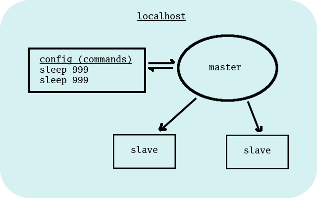

# Configurable Local DaemonSet

A RESTful local daemonset (similiar to Kubernetes, but local).

All data is held in memory, all transfer is via JSON.

## Features

- persists state to a local configuration file
- uses daemon __processes__
- linux-based
 
## Installation

- __Go__ is required (version 1.10 or later)

Fetch this project as follows:

	$ go get -u github.com/mramshaw/colds

This could also be done with __git__ of course:

	$ git clone https://github.com/mramshaw/colds.git

Any dependencies will be fetched in the __build__ process.

## To Do

- [ ] Investigate upgrading to gRPC or HTTP2
